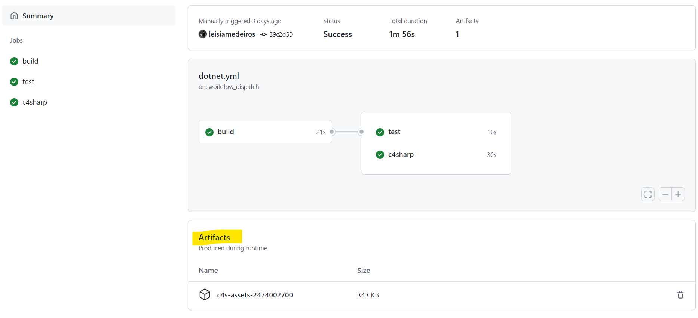

# Workflow status

# C4Bank Sample

> ⚠️ **ATTENTION**! This is a copy from [https://github.com/8T4/c4sharp/tree/main/samples/C4Bank](https://github.com/8T4/c4sharp/tree/main/samples/C4Bank) 

### This repo was created just to show how to:

- Create a [github action](https://github.com/leisiamedeiros/c4bank-artifacts/actions/workflows/dotnet.yml) to publish **c4sharp** assets as **artifacts** on [workflows](https://github.com/leisiamedeiros/c4bank-artifacts/actions/runs/2474002700#artifacts) using `c4scli`.

### About the workflow .yml file

There are three jobs on the [workflow yml file](https://github.com/leisiamedeiros/c4bank-artifacts/blob/main/.github/workflows/dotnet.yml) and their responsibilities are showed bellow:

- Build
  - To build the application and save its compilated code on cache
- Test
  - Restore compilated code from cache and execute dotnet tests
- C4sharp
  - Instal c4scli to generate the artifacts 
  - Restore compilated code from cache 
  - Generate c4s artifacts using c4scli command
  - Publish artifacts
